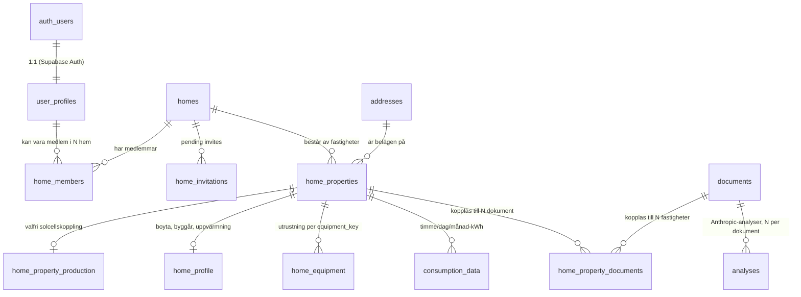

[UTKAST — under granskning]

# Mina sidor — arkitekturdokument V2 (utkast)

**Datum:** 2026-05-06
**Författare:** Cowork-utkast baserat på beslut från Mattias + Claude-i-chatt
**Status:** UTKAST — granskas av Mattias innan migration påbörjas

> Detta utkast beskriver omskrivningen från V1 (anlaggnings_id som nav) till V2 (hem som nav). Innan utkastet ersätter `MINA-SIDOR-ARKITEKTUR.md` ska det granskas och godkännas av Mattias. Faktiska SQL-statements i `supabase/schema.sql` skrivs efter att utkastet är godkänt.

> **Regel:** Varje PR som ändrar ett arkitekturbeslut eller datamodellen ska uppdatera detta dokument i samma commit (när dokumentet är godkänt).

---

## 1. Sammanfattning

Mina sidor är där en kund **sparar fakturor över tid** och får löpande analys och optimering av sitt elbruk. Det är där Homeii går från en engångsanalys till en kontinuerlig energirådgivare.

Idag är fakturaflödet helt ephemeralt: PDF laddas upp → parsas via Anthropic → resultat visas → försvinner när fliken stängs. Hela värdet ligger i **longitudinell intelligens** — att över tid se hur ett hushåll konsumerar och lära sig optimera. Utan sparade fakturor är vi en glorifierad fakturatolk. Med sparade fakturor blir vi en energirådgivare som lär sig hushållet.

**Hem som koncept.** I V2 är ett "hem" en användarkurerad sammanställning av en eller flera fastigheter, snarare än en fysisk fastighet i sig. Användaren kan t.ex. ha ett hem "Vår villa" (en fastighet), ett hem "Sommarstugan" (en annan fastighet), och ett tredje hem "Min totala konsumtion" som omfattar villan, sommarstugan och föräldrarnas hus där användaren är medlem. Hem-konceptet speglar användarens analytiska behov, inte den fysiska geografin.

**Vi har låst (utkastnivå):** Hem-modellen, datamodell V2, RLS-policys på hem-nivå, beslut 6.13 och 6.15–6.18 (se sektion 6). 6.14 är medvetet en lucka i numreringen, reserverad för framtida beslut.

**Vi bygger nu:** Schema-migration från V1 till V2, omskrivning av spara-flödet med hem-väljaren.

---

## 2. Sajtstruktur

### 2.1 Publika routes (ingen inloggning krävs)

| Route | Beskrivning | Status |
|---|---|---|
| `/` | Landing — anonym uppladdning + Teaser-analys | Live |
| `/analys` | Komplett analysflöde (upload → verify → resultat → dashboard) | Live |
| `/kunskap` | Kunskapshub — guider, räkneexempel, nyheter, ordlista | Live (undersidor är placeholders) |
| `/om` | Om-hub — Så funkar det, Om oss, Oberoende roll, Integritet, Kontakt | Live |
| `/partners` | Partnersamarbeten | Live |

### 2.2 Auth-skyddade routes — Mina sidor

| Route | Sida | Prio |
|---|---|---|
| `/app/hem` | Hemöversikt / dashboard | 1 |
| `/app/min-plan` | Min plan — personliga rekommendationer | 1 |
| `/app/mitt-hem` | Mitt hem — husdata och utrustning | 2 |
| `/app/mina-dokument` | Mina dokument — repository för alla uppladdade dokument | 2 |
| `/app/mina-offerter` | Offerter från installatörer | 2 |
| `/app/mina-erbjudanden` | Erbjudanden från partners (framtida) | 3 |
| `/app/min-uppfoljning` | Uppföljning — historik och trender | 2 |
| `/app/min-kunskap` | Personaliserad kunskapshub | 2 |
| `/app/notiser` | Notiser | 3 |
| `/app/installningar` | Inställningar — konto, members, prenumeration | 2 |

`/kunskap` är en publik route som inte kräver inloggning. Inloggade användare får i stället `/app/min-kunskap` — en separat auth-skyddad route med filtrerat innehåll baserat på `home_profile` och `home_equipment`. Ingen villkorlig rendering på samma route.

### 2.3 API-routes (intern)

| Route | Funktion |
|---|---|
| `/api/parse-invoice` | Anthropic-parsning av PDF-faktura |
| `/api/chat` | Chat-flöde |
| `/api/spot-prices` | Spotpriser |
| `/api/historical-prices` | Historiska priser |
| `/api/monthly-spot-averages` | Månadssnitt spotpriser |
| `/api/pvgis-tmy` | PVGIS TMY-data för solcellsberäkning |

---

## 3. Mina sidor-sidor med prio

| Sida | Route | Prio | Beskrivning |
|---|---|---|---|
| Hem | `/app/hem` | **1** | Startvy vid inloggning. Senaste faktura, elbesparing YTD, genvägar till plan och uppföljning. |
| Min plan | `/app/min-plan` | **1** | Personliga rekommendationer baserade på fakturahistorik och hemdata. Länk till relevanta offerter. |
| Mitt hem | `/app/mitt-hem` | **2** | Hemdata: adress, boyta, byggår, byggnadstyp, befintlig utrustning (värmepump, solceller, batteri m.m.). Auto-fylls från faktura, bekräftas av användaren. |
| Mina dokument | `/app/mina-dokument` | **2** | Dokumentrepository för alla uppladdade dokument oavsett typ — elhandelsfakturor, elnätsfakturor, offerter och övriga dokument. Filtrerbar per fastighet. Kompletterar `/app/mina-offerter` (som är specialiserad på offert-analys). |
| Mina offerter | `/app/mina-offerter` | **2** | Inkomna offerter från installatörer, kopplade till rekommenderade åtgärder. Specialvy för offert-analys (jämförelse, bedömning) — komplement till generella `/app/mina-dokument`. |
| Mina erbjudanden | `/app/mina-erbjudanden` | **3** | Erbjudanden från Homeii-partners (tillverkare, leverantörer). Placeholder i v1 — innehåll kommer när partnersamarbeten är på plats. |
| Min uppföljning | `/app/min-uppfoljning` | **2** | Fakturahistorik, förbrukningsgrafer, jämförelse mot föregående period och liknande hushåll. |
| Min kunskap | `/app/min-kunskap` | **2** | Filtrerad version av publika `/kunskap` baserat på `home_profile` och `home_equipment`. |
| Inställningar | `/app/installningar` | **2** | Kontoinställningar, notifpreferenser, hantera members och roller, prenumerationsinfo. |
| Notiser | `/app/notiser` | **3** | Avisering om elpristoppar, nya analyser klara, åtgärdspåminnelser. |

**Prio 1** = byggs i nästa PR (auth-flöde + spara-faktura + grundläggande Hem/Min plan).
**Prio 2** = byggs stegvis i efterföljande PR:ar.
**Prio 3** = framtid, beroende av affärsbeslut och Stripe-integration.

---

## 4. Datamodell

### 4.1 Diagram



**M:N-relation:** `home_properties ↔ documents` är en M:N-relation som realiseras via kopplingstabellen `home_property_documents`. En faktura kan tillhöra flera hem (via olika home_properties), och en home_property kan referera till flera dokument.

### 4.2 Tabellöversikt (13 tabeller, definierade i `supabase/schema.sql`)

| Tabell | Roll |
|---|---|
| `user_profiles` | Homeii-specifik användardata, kopplad 1:1 till `auth.users`. Innehåller `subscription_*`-fält som förbereder Stripe (prio 3, aktiveras ej förrän Stripe byggs). |
| `addresses` | Fysisk plats — flera fastigheter (`home_properties`) kan dela adress (t.ex. lägenhetshus där flera mätarpunkter finns på samma fysiska byggnad). |
| `homes` | **Navet i V2.** En användarkurerad sammanställning av en eller flera fastigheter. PK = `home_id uuid`. Bär hemmets namn (valt av användaren) och hemmets metadata. |
| `home_members` | M:N — vem har åtkomst till vilket hem + roll (`owner` / `member` / `read_only`). Ersätter V1:s `metering_point_members`. |
| `home_invitations` | Pending-invites till ett hem, engångs-tokens. Ersätter V1:s `metering_point_invitations`. |
| `home_properties` | En fastighet (verklig eller fiktiv) som ingår i ett hem. FK till `homes.home_id` och `addresses.id`. Har kolumnen `property_type text check (property_type in ('real', 'hypothetical'))` och en valfri kolumn `anlaggnings_id text` (null när `property_type = 'hypothetical'`). |
| `home_property_production` | Solcellskoppling. M:1 mot `home_properties` (max en produktions-koppling per konsumtions-property). Innehåller produktions-`anlaggnings_id` och produktions-relaterad metadata. Ersätter V1:s `production_metering_points`. |
| `home_property_documents` | Kopplingstabell M:N mellan `home_properties` och `documents`. Varje rad representerar att ett dokument är kopplat till en specifik fastighet inom ett hem. |
| `documents` | Sparade dokument — fakturor **och** offerter. PDF i Storage + parsed JSON + denormaliserade fält. Kolumn `document_type`: `'invoice'` \| `'offer'`. **Skillnad mot V1:** ingen direkt FK till mätarpunkt. Kopplingen sker via `home_property_documents`. |
| `analyses` | Anthropic-analysresultat kopplat till ett dokument (N:1). Sparar modell-version, råsvar och strukturerat resultat separat — möjliggör re-analys när modellerna förbättras. **Oförändrad från V1.** |
| `consumption_data` | Granular kWh-data (timme/dag/månad). FK till `home_properties.id`. Logiskt hänger granular data på en specifik fastighet, inte på hemmet. |
| `home_profile` | Hemdata per fastighet: boyta, byggår, byggnadstyp, uppvärmningssätt. PK / FK till `home_properties.id`. Auto-fylls och bekräftas av användaren. |
| `home_equipment` | Utrustning per fastighet — ett rad per `(home_property_id, equipment_key)` med typat JSONB-fält `equipment_data`. TypeScript-typer definieras i `lib/types/home-equipment.ts` (källa till sanning för equipment-schemat). |

`spot_prices` och `monthly_avg_prices` finns kvar från V1 men hör inte till Mina sidor-modellen — de räknas inte in i de 13 tabellerna ovan.

**Migration från V1:** Vid migration flyttas kolumnerna `country`, `zone`, `kommun` och `network_operator` från V1:s `consumption_metering_points` till V2:s `home_properties`.

### 4.3 Tre roller i home_members

Roller flyttas från mätarpunkt-nivå (V1) till hem-nivå (V2). Behörighetsmodellen är oförändrad — bara skopet ändras.

| Action | `owner` | `member` | `read_only` |
|---|---|---|---|
| Läsa dokument, analyser, hemdata | ✓ | ✓ | ✓ |
| Ladda upp dokument | ✓ | ✓ | ✗ |
| Redigera och radera dokument | ✓ | ✓ | ✗ |
| Lägga till / ta bort fastigheter i hemmet | ✓ | ✓ | ✗ |
| Bjuda in ny `member` eller `read_only` | ✓ | ✓ | ✗ |
| Sparka ut member / ändra roller | ✓ | ✗ | ✗ |
| Överlåta ägarskap av hemmet | ✓ | ✗ | ✗ |
| Stänga / radera hela hemmet | ✓ | ✗ | ✗ |
| Hantera prenumeration | ✓ | ✗ | ✗ |

`read_only` är avsedd för t.ex. en sambo som bara ska följa konsumtionen men inte ladda upp fakturor, eller för framtida tredjepartsgranskning. Bjuds in explicit av owner eller member.

### 4.4 subscription_*-fält på user_profiles

Läggs till i schemat nu men aktiveras inte förrän Stripe-integration byggs (prio 3). **Oförändrad från V1.**

```sql
subscription_status       text
  check (subscription_status in ('active', 'canceled', 'past_due')),
                                          -- null = gratis/ej prenumerant
subscription_external_id  text,          -- Stripe customer-ID när det blir aktuellt
subscription_active_until timestamptz    -- nuvarande periodslut
```

### 4.5 transfer_ownership

PL/pgSQL-funktion `public.transfer_ownership(p_home_id uuid, p_new_owner_id uuid)` som atomiskt inom samma transaktion:

1. Verifierar att anroparen är nuvarande aktiva ägare av hemmet
2. Verifierar att mottagaren är aktiv medlem av hemmet
3. Sätter den nuvarande ägarens `role` till `'member'`
4. Sätter mottagarens `role` till `'owner'`

Båda förblir aktiva medlemmar — `left_at` rörs inte. Det partiella unika indexet på aktiv ägare (se 7.6) säkrar att det aldrig finns två ägare samtidigt på samma hem.

**Skillnad mot V1:** Argumentet är nu `p_home_id uuid` istället för `p_anlaggnings_id text`. Funktionen pekar på `home_members` istället för `metering_point_members`.

---

## 5. RLS-modell i sammandrag

### 5.1 Tre hjälpfunktioner

```sql
-- Är användaren aktiv i detta hem (valfri roll)?
public.user_is_home_member(p_home_id uuid) → boolean

-- Är användaren aktiv ägare av hemmet?
public.user_is_home_owner(p_home_id uuid) → boolean

-- Kan användaren skriva i hemmet (owner eller member — inte read_only)?
public.user_can_write_home(p_home_id uuid) → boolean
```

`read_only`-rollen ger enbart läsåtkomst. Alla `insert`-, `update`- och `delete`-policys kräver `user_can_write_home()`. Läs-policys (`select`) kräver `user_is_home_member()`.

**Skillnad mot V1:** Hjälpfunktionerna är omdöpta (`user_is_member` → `user_is_home_member` etc.) och tar `p_home_id uuid` istället för `p_anlaggnings_id text`. Detta tydliggör att skopet är hem-nivå, inte mätarpunkt-nivå.

### 5.2 Åtkomstöversikt

| Tabell | Vem läser | Vem skriver |
|---|---|---|
| `user_profiles` | Användaren själv | Användaren själv |
| `addresses` | `user_is_home_member` (via kopplad fastighet i ett av användarens hem) | — (skapas via spara-flöden) |
| `homes` | `user_is_home_member` | `user_can_write_home` (uppdatera namn m.m.), `user_is_home_owner` (delete) |
| `home_members` | `user_is_home_member` | `user_can_write_home` (bjuda in), `user_is_home_owner` (ändra roll, ta bort) |
| `home_invitations` | `user_is_home_member` + mottagare (på e-post) | `user_can_write_home` |
| `home_properties` | `user_is_home_member` | `user_can_write_home` |
| `home_property_production` | `user_is_home_member` (via kopplad home_property) | `user_can_write_home` |
| `home_property_documents` | `user_is_home_member` (via kopplad home_property) | `user_can_write_home` |
| `documents` | `user_is_home_member` (via minst en koppling i `home_property_documents`) | `user_can_write_home` |
| `analyses` | `user_is_home_member` (via dokumentkoppling) | `user_can_write_home` (skapa/uppdatera), service role för bulk-jobb |
| `consumption_data` | `user_is_home_member` (via kopplad home_property) | Systemet (service role) |
| `home_profile` | `user_is_home_member` | `user_can_write_home` |
| `home_equipment` | `user_is_home_member` | `user_can_write_home` |
| Storage `documents`-bucket | `user_is_home_member` | `user_can_write_home` |

Service-role-nyckeln bypassar RLS — används bara server-side för admin-jobb (t.ex. cron-rensning), aldrig klient-side.

<!-- TODO: åtkomst till `documents` är M:N-baserad (ett dokument är synligt om användaren har minst en koppling via `home_property_documents` till något av sina hem). RLS-policyn behöver en EXISTS-subquery — formuleras i schema-omskrivningen. -->

---

## 6. Arkitekturbeslut

Numreringen följer V1 där så är möjligt. **6.14 är medvetet en lucka — reserverad för framtida beslut.**

### 6.1 Tre prismässiga nivåer

| Nivå | Tröskel | Innehåll |
|---|---|---|
| **Teaser** | Anonym uppladdning | Uppskattning årlig betalning + synliggörande av vad användaren betalar + jämförelse mot grannar/Sverige/villaägare |
| **Bas** | Skapa konto | Sparade fakturor, Mina sidor, historik över tid (permanent gratis) |
| **Premium** | Framtid | Specifika rekommendationer + framtida funktioner. Prismodell ej låst. |

Konvertering Teaser→Bas sker vid wow-ögonblicket efter att användaren sett analysen, inte före.

### 6.2 Spara både PDF och JSON

Inte bara parsad data. Storage är försumbart i Supabase (~$1/mån för 1 000 hushåll × 24 fakturor). Att behålla PDF:en ger oss option att re-parsa när modellerna blir bättre, och låter användarna ladda ner sina egna fakturor.

### 6.3 Adress som nav inom hem-strukturen (omformulerat i V2)

Användare attacheras till hem (via `home_members`), inte till adresser direkt. Adressen är en attribut på `home_properties` — ett hem kan innehålla flera fastigheter på olika adresser (villa + sommarstuga + föräldrarnas hus). Tidigare modell (adress som central nav) ersattes av hem-modellen för att stödja användarens kuraterade vy av sina fastigheter.

### 6.4 Soft delete vid borttagning

PDF raderas direkt, JSON behålls med PII strippad (bara konsumtionsmönster + region kvar) för aggregat-modell. Kräver tydlig text i integritetspolicyn.

Se även Beslut 6.16 (referens-räkning) — ett dokument soft-raderas först när sista hemkopplingen bryts.

### 6.5 Adressverifiering = explicit invite

Existerande ägare måste explicit bjuda in nya medlemmar via mejl. Säkerhet > bekvämlighet i v1 — det räcker inte att Erik laddar upp en faktura med "Storgatan 5" för att automatiskt få se Annas data.

### 6.6 Konsumtions-anläggningsID som universell teknisk identifierare (omformulerat i V2)

Anläggnings-ID är 18 siffror, finns på alla svenska elhushåll, och är den naturliga identifieraren för en fysisk mätarpunkt. Det lagras som text-kolumn på `home_properties` (där `property_type='real'`). Men det är **inte** primary key — se Beslut 6.17. Skälet: samma anläggnings-ID kan ingå i flera hem hos olika användare, vilket ett unique-constraint som PK skulle blockera.

För `home_properties` med `property_type='hypothetical'` är `anlaggnings_id`-kolumnen `null`.

### 6.7 Produktions-anläggningsID som valfri koppling till konsumtions-fastighet (omformulerat i V2)

För solcellshushåll. Hänger på samma fysiska adress som konsumtionen men är distinkt i elnätet. Lagras i den nya `home_property_production`-tabellen som M:1 mot `home_properties` (i praktiken 1:0..1, då en konsumtions-property kan ha max en kopplad produktion). Detta tillåter att samma produktions-ID förekommer i flera hem hos olika användare (t.ex. sambopar med solceller på villatak, där båda har egna hem som inkluderar fastigheten).

### 6.8 Produktprincip: bekräfta över ifyllnad

All data som kan extraheras från fakturan ska auto-fyllas och bara **bekräftas** av användaren — aldrig manuellt knappas in från noll. Gäller adress, anläggnings-ID, elhandelsbolag, period, förbrukning, kostnader. Skiljer Homeii från typiska kalkylatorer där användaren själv klickar in 50 fält.

### 6.9 Adress autodetekteras från fakturan

När användaren skapar konto efter sin Teaser-analys är första steget en bekräftelse: *"Vi tolkade adressen som Storgatan 5, 113 33 Stockholm — stämmer det?"*. Direkt tillämpning av princip 6.8.

### 6.10 Hem är en användarkurerad sammanställning, inte en fysisk fastighet (omformulerat i V2)

Hem är en användarkurerad sammanställning, inte en fysisk fastighet. Flera anlaggnings_id kan finnas i samma hem; samma anlaggnings_id kan finnas i flera hem (hos olika användare). Användarens "hem" i Homeii speglar användarens analytiska behov — t.ex. "Min totala konsumtion" som inkluderar villan, sommarstugan, och föräldrarnas hus.

**Ersätter V1:s 6.10** ("v1: 1 konsumtions-anläggningsID = 1 hem"), som var ett medvetet förenklat antagande för v1 men visade sig otillräckligt för verkliga användarbehov (sambopar med separata kontoperspektiv, sommarstugor, släktingars boenden, scenario-analys av husköp).

### 6.11 Roll-modell: Owner = admin/billing, Member = full operativ åtkomst, read_only = läsåtkomst

Se sektion 4.3 för fullständig behörighetstabell. Som Spotify Family — den inbjudna kan göra allt utom de oåterkalleliga och ekonomiska besluten. `read_only` lägger till ett tredje läge för läsande tredje part (sambo utan ansvar, hyresvärd, etc.).

Ägarskaps-överlåtelse sker via den atomiska `transfer_ownership`-funktionen (se 4.5). I V2 är skopet hem (`p_home_id uuid`) istället för mätarpunkt.

### 6.12 documents ersätter invoices — generaliserat dokumentlager

`documents`-tabellen hanterar alla inkommande externa dokument: fakturor (`'invoice'`) och offerter (`'offer'`). Parsning och lagring är identisk — bara `document_type` skiljer. `analyses`-tabellen håller Anthropic-analysresultaten separat från dokumentlagringen, vilket möjliggör:

- Re-analys av ett befintligt dokument utan att duplicera PDF
- Flera analysversioner per dokument (A/B-test av promptar, modelluppgraderingar)
- Tydlig separation mellan "källdokument" och "tolkning"

I V2 är dokumentet inte längre direktkopplat till en mätarpunkt — kopplingen sker via `home_property_documents` (se Beslut 6.15).

### 6.13 Stöd för fiktiva fastigheter

`home_properties` har en `property_type`-kolumn med värdena `'real'` eller `'hypothetical'`. Fiktiva fastigheter används för scenario-analys (husköp, planerat attefallshus). De har inget `anlaggnings_id` och dyker inte upp i framtida referensvyer för aggregerade jämförelser.

<!-- 6.14 — medveten lucka, reserverad för framtida beslut. -->

### 6.15 Dokument är M:N-kopplade till hem

En faktura kan tillhöra flera hem samtidigt. En användare kan välja att lägga samma faktura i "Vår villa" och "Min totala konsumtion". Implementeras via kopplingstabellen `home_property_documents` där varje rad representerar en koppling mellan ett `home_property` och ett `documents`-rad. PDF:en lagras endast en gång i Supabase Storage — kopplingen är på metadata-nivå.

### 6.16 Dokument-radering via referens-räkning

Ett dokument lever så länge minst ett hem (via `home_property`) refererar till det. När sista hem-länken bryts, mjukraderas dokumentet (PDF i Storage + rad i `documents`) enligt befintlig soft-delete-policy (Beslut 6.4). Den parsade datan utan PII behålls för aggregat-modell. Detta är medvetet för att tillåta att en användare delar ett hem med en annan, sedan raderar sitt eget konto, utan att den andra användarens hem-data försvinner.

### 6.17 Egen UUID som primary key på homes

`homes`-tabellen har en `home_id uuid` som primary key. `anlaggnings_id` är inte längre primary key någonstans — det är en vanlig text-kolumn på `home_properties`. Detta gör att samma `anlaggnings_id` kan förekomma i flera `home_properties`-rader (en per hem som inkluderar fastigheten).

### 6.18 Spara-flöde UX

**Första gången användaren sparar (inga befintliga hem):** Skippa hem-väljaren. Auto-skapa "Hem på [adress]" som första hem. Användaren kan döpa om i Inställningar/Mitt hem senare.

**Andra och senare gånger:** Visa checkbox-lista med alla användarens hem plus "Skapa nytt hem"-alternativ.

- **Smart match:** Om fakturans `anlaggnings_id` redan finns i ett eller flera av användarens hem, förkrycka dessa hem automatiskt.
- **Adaptiv förförklarande text:**
  - **Matchat 1 hem:** "Den här anläggningen finns redan i 'Hem på Storgatan 5' men välj vilka hem du vill lägga till fakturan i."
  - **Matchat flera hem:** "Den här anläggningen finns redan i 'Hem på Storgatan 5' och 'Min totala konsumtion' men välj vilka hem du vill lägga till fakturan i."
  - **Ingen match:** "Vi kunde inte hitta liknande fakturor i något befintligt hem. Välj vilka hem du vill lägga till fakturan i." (med "Skapa nytt hem" förkryssat)

**"Skapa nytt hem"-flöde:** Användaren får skriva in hemmets namn aktivt. Inget default-namn — aktivt val kräver aktiv namngivning.

---

## 7. Strukturella designval — varför schemat ser ut som det gör

### 7.1 `user_profiles` extends `auth.users` istället för en custom `users`-tabell

Supabase Auth hanterar registrering, magic links och sessioner i den interna tabellen `auth.users`. Vi äger inte den tabellen — Supabase kan ändra den vid uppdateringar. Därför skapar vi `public.user_profiles` med samma `id` (UUID) för Homeii-specifik data.

En trigger (`on_auth_user_created`) auto-skapar profil-raden vid registrering.

### 7.2 `anlaggnings_id` som `text`, inte `bigint`

Anläggnings-ID är 18 siffror men lagras som text:

- Inledande nollor bevaras
- Framtida formatändringar hanteras utan migration
- Vi gör aldrig matte på fältet — det är en identifierare, inte ett mätvärde

Samma logik som telefonnummer.

I V2 ligger `anlaggnings_id` på `home_properties` som en vanlig text-kolumn (inte PK). Se Beslut 6.6 och 6.17.

### 7.3 Denormaliserade snabb-läs-fält på `documents`

Hela parsade JSON-objektet sparas i `parsed_data jsonb`, men de mest använda fälten (`total_kr`, `consumption_kwh`, `spot_price_ore_kwh`, `electricity_supplier`) sparas **också** som egna kolumner för snabba dashboard-queries utan JSON-parsning.

### 7.4 Soft delete via `deleted_at`-kolumner

Tidsstämpel istället för direkt radering. Queries filtrerar `WHERE deleted_at IS NULL`. Möjliggör ångra-support, GDPR-grace-period och PII-stripping för aggregat-modell.

I V2 omfattas detta även av referens-räkningen i Beslut 6.16 — ett dokument får `deleted_at` satt först när sista hemkopplingen via `home_property_documents` bryts.

### 7.5 RLS via hjälpfunktioner

Centraliserad logik i `user_is_home_member()`, `user_is_home_owner()`, `user_can_write_home()` istället för duplicerad EXISTS-subquery i varje tabells policy. Minimerar risken för att missa en tabell vid framtida ändringar.

### 7.6 Partial unique index = max en aktiv ägare per hem

```sql
create unique index idx_one_active_owner_per_home
  on public.home_members(home_id)
  where role = 'owner' and left_at is null;
```

Garanterar på databasnivå att det aldrig finns två aktiva ägare av samma hem. Skyddar mot race conditions och buggar i applikationskoden.

### 7.7 home_equipment — typat JSONB med TypeScript-spegling

Utrustningsdata varierar kraftigt per typ (en värmepump har andra fält än solceller). Lösningen är ett fält `equipment_data jsonb` per `(home_property_id, equipment_key)`-rad i databasen, med tillhörande TypeScript-typer i `lib/types/home-equipment.ts` som är källa till sanning för vilket JSON-schema varje `equipment_key` förväntar sig. Ger flexibilitet i databasen och typsäkerhet i applikationskoden.

<!-- TODO: TypeScript-typen `EquipmentRow` har idag fältet `anlaggnings_id`. Vid migration ska detta byta till `home_property_id uuid`. Se INVENTERING-SCHEMA-OMSKRIVNING.md. -->

### 7.8 Hem som koncept istället för fastighet (nytt i V2)

I V1 var navet `consumption_metering_points` med `anlaggnings_id` som primary key — "ett anläggnings-ID = ett hem". Detta är konceptuellt rent men passar inte verkligheten:

- **Sambopar med separata kontoperspektiv** vill kanske se samma fysiska anläggning i två separata hem-vyer (eller delas via `home_members`).
- **Sommarstugor, släktingars boenden, dubbla bosättningar** behöver kunna grupperas på olika sätt — t.ex. ett hem "Min totala konsumtion" som omfattar både egna och föräldrarnas anläggningar.
- **Scenario-analys** (husköp, planerat attefallshus) kräver "fiktiva fastigheter" som inte har anläggnings-ID alls — omöjligt om ID är PK.
- **Aggregat-jämförelser** (se sektion 9) kräver att vi kan urskilja fysiska fastigheter (deduplicering på `anlaggnings_id`) från fiktiva.

Lösningen är att bryta sambandet mellan "hem" och "fastighet". Hem (`homes`) blir en användarkurerad sammanställning med egen UUID-PK, och fastigheter (`home_properties`) blir tillhörande rader som kan vara verkliga eller fiktiva. Samma fysiska anläggning kan ingå i flera hem hos flera användare utan unique-constraint-konflikter.

Trade-off: Schemat blir bredare (fler tabeller, fler joins). Vinsten är att UI och produktnarrativ kan följa användarens mentala modell istället för att tvinga in den i en teknisk identifierare.

---

## 8. Implementationssekvens

> **Status:** Sektion 8 reflekterar V1-implementationssekvensen. Den ska skrivas om för V2 av Mattias och Claude-i-chatt baserat på V2-besluten. Ignorera tills omskrivningen är klar.

I strikt prioritetsordning. Bygg inte parallellt — varje steg bygger på föregående.

### Steg 1: Förberedelser i Supabase (~30 min)

1. SQL Editor → kör hela `supabase/schema.sql` (skapar **11 tabeller** + RLS-policys + triggers + `transfer_ownership`-funktion)
2. Storage → New bucket `documents`, private, 10 MB file limit
3. Lägg till Storage RLS-policys (template kommenterad i slutet av `schema.sql`)
4. Verifiera Vercel env vars — alla fyra för Production, Preview *och* Development:
   - `NEXT_PUBLIC_SUPABASE_URL`
   - `NEXT_PUBLIC_SUPABASE_ANON_KEY`
   - `SUPABASE_URL`
   - `SUPABASE_SERVICE_ROLE_KEY`

### Steg 2: Auth-flöde (~1–2 dagar)

- Magic link via `supabase.auth.signInWithOtp({ email })` och Google OAuth via `supabase.auth.signInWithOAuth({ provider: 'google' })`
- Global inloggad/utloggad state via Supabase Auth-listener
- Skydda `/app/*`-routes via Next.js middleware
- Logga ut + session refresh

### Steg 3: "Spara faktura"-flöde (~2–3 dagar)

- Efter lyckad anonym uppladdning → CTA "Skapa konto för att spara analysen"
- Magic link → bekräfta adress extraherad från fakturan
- Vid bekräftelse, atomisk transaktion:
  1. Skapa eller hitta `addresses`-rad
  2. Skapa `consumption_metering_points`
  3. Skapa `metering_point_members`-rad med `role='owner'`
  4. Ladda upp PDF till Storage-bucket `documents`
  5. Skapa `documents`-rad med `document_type='invoice'`, PDF-path och `parsed_data`
  6. Skapa `analyses`-rad med Anthropic-resultat kopplat till dokumentet
  7. Skapa `home_profile`-rad med data extraherad från fakturan (bekräftas i nästa steg)

### Steg 3.5: Scaffolda Mina sidor-rutter och navigation (~0.5 dag) — KLART

Skapa alla `/app/*`-rutter som tomma stubs plus en gemensam sidomeny i
`app/app/layout.tsx`. Syfte: kollegor kan börja jobba parallellt med
innehållet på varje sida medan databas-arbetet (Steg 3) pågår eller
fortsätter därefter. Tio rutter scaffoldade: `/app/hem`, `/app/min-plan`,
`/app/min-uppfoljning`, `/app/mitt-hem`, `/app/mina-dokument`,
`/app/mina-offerter`, `/app/mina-erbjudanden`, `/app/min-kunskap`,
`/app/notiser`, `/app/installningar`.

### Steg 4: Mina sidor prio-1 UI (~2–3 dagar)

- `/app/hem` — senaste faktura, elbesparing YTD, genvägar
- `/app/min-plan` — rekommendationer baserade på fakturahistorik
- `/app/min-uppfoljning` — lista sparade fakturor per mätarpunkt, klick öppnar sparad analys

### Steg 5: Mitt hem (~1–2 dagar)

- `/app/mitt-hem` — visa och redigera `home_profile` och `home_equipment`
- Bekräfta/korrigera adress och husdata som auto-fylldes i steg 3

### Steg 6: Mina sidor prio-2 UI (~2–3 dagar)

- `/app/mina-offerter` — lista `documents` med `document_type='offer'`
- `/app/installningar` — kontoinställningar, notifpreferenser, members-hantering

### Steg 7: Invite-member-flöde (~1–2 dagar)

- Bjud-in-knapp → mejladress + roll (`member` eller `read_only`)
- Token i `metering_point_invitations`, 7 dagars expiry
- Accept-flow: validera token → skapa `metering_point_members`-rad → redirect till `/app/hem`

### Steg 8: Premium-gate UI (prio 3)

Byggs inte förrän affärsbeslut om innehåll och prismodell är tagna — dessa är öppna produktfrågor (se sektion 9). Stripe-integration är ett separat projekt (se CLAUDE.md) och är en förutsättning för att premium-gate ska bli funktionell.

- Blurrad teaser av detaljerade rekommendationer för Bas-användare
- "Uppgradera till Premium" CTA — UI-skiss tills prismodell och Stripe är på plats

---

## 9. Öppna produktfrågor

Inte arkitekturkritiska — kan besvaras under bygget.

- **Innehållet i Bas-nivån i detalj.** Vilka exakta funktioner är "grundläggande kontofunktionalitet"?
- **Premium-prismodell.** $X/mån, B2B, freemium-features? Beslut behövs först när Premium-funktioner börjar byggas.
- **Föräldralösa hem.** När sista medlemmen lämnar ett hem — hur länge stannar hemmet innan auto-arkivering? GDPR-fråga.
- **read_only-use cases.** Ska rollen exponeras i UI direkt i v1, eller bara finnas i schemat tills ett konkret behov uppstår?
- **home_equipment-evolution.** Vilka `equipment_key`-värden är must-have i v1? Se `lib/types/home-equipment.ts` för nuläget.
- **Referensdatabas för aggregerade jämförelser.** För att kunna jämföra ett hushåll mot "liknande hus i SE3-zonen med samma boyta" kommer Homeii initialt använda externa datakällor (EI:s databas, elnätsägares tabeller). När intern datavolym är tillräckligt stor planeras en intern referensvy som deduplicerar fysiska `anlaggnings_id` från `home_properties` och exkluderar fiktiva fastigheter. Tidsplan ej satt — beslutas när volymen motiverar bygget.

---

## 10. Internationaliseringsstatus

Schemat är primärt designat för svenska elhushåll. Inför internationell expansion (Europa) behöver följande adresseras:

**Förberedda men inte aktiva:**

- `addresses.country` defaultar till `'SE'` men accepterar valfri landskod (text-fält utan check-constraint)
- `home_properties` har country-fältet som identifierar fastighetens land
- Latitude och longitude är universella

**Låst till Sverige idag:**

- `home_properties.zone` har check-constraint för SE1-SE4. Andra länder har egna budområden (t.ex. Norge NO1-NO5, Tyskland en helt annan struktur). Constraintet behöver utvidgas eller refaktoreras vid expansion.
- Konceptet `anlaggnings_id` är svenskt (Svenska kraftnäts 18-siffriga ID). Andra länder har egna ID-system (Målepunkt-ID i Norge, MaLo/MeLo-ID i Tyskland, MPAN i UK). Vid expansion krävs antingen en kompromiss där "fastighet" identifieras annorlunda, eller en land-specifik ID-strategi. I V2 är detta lättare att hantera än i V1 eftersom `anlaggnings_id` inte längre är PK — `home_properties` kan rymma andra ID-typer i parallella kolumner eller en country-specific lookup-tabell.
- `/api/parse-invoice` använder en Anthropic-prompt som specifikt beskriver svenska elräkningar. Multilanguage-stöd kräver land-specifika prompts.
- Befintliga `spot_prices` och `monthly_avg_prices`-tabeller har `market_id`-fält som antyder förberedelse för fler marknader, men sammankopplingen med Mina sidor-tabellerna är inte etablerad.

**Vid första utländska lansering:** Detta blir en separat migration som adresserar punkterna ovan. Inte arkitekturkris, men inte heller en trivial ändring.

---

## 11. Referenser

- **`supabase/schema.sql`** — komplett databasschema. **Uppdateras i samma migration som V2-schemat skrivs (se Implementationssekvens).** Tills migrationen är genomförd reflekterar `schema.sql` fortfarande V1-modellen (mätarpunkter, inte hem).
- **`INVENTERING-SCHEMA-OMSKRIVNING.md`** — komplett inventering av all kod som refererar till V1:s metering_point-tabeller. Användes som underlag för att estimera omfattning av V2-omskrivningen. Se branch `chore/inventera-metering-point-referenser` (commit `4831304`).
- **`lib/types/home-equipment.ts`** — TypeScript-typer för `home_equipment.equipment_data` per `equipment_key`. Källa till sanning för equipment-schemat. Behöver uppdateras vid migration så att `EquipmentRow.anlaggnings_id` byter till `home_property_id` (se 7.7).
- **Supabase Auth-dokumentation:** https://supabase.com/docs/guides/auth
- **Supabase RLS-dokumentation:** https://supabase.com/docs/guides/auth/row-level-security
- **Anläggnings-ID-konceptet (Svenska kraftnät):** sökord "anläggningsidentifierare elnät"
